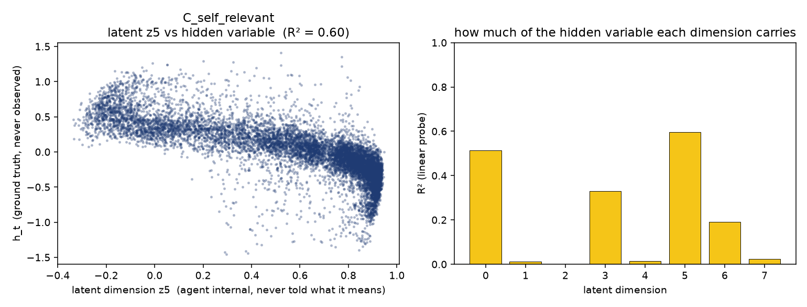
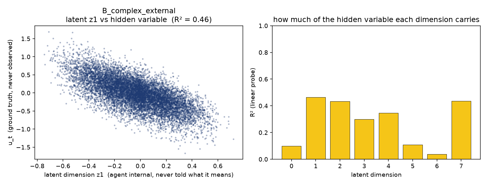

# 递归自我模型涌现假说 / Recursive Self Model Emergence Hypothesis

**RSMEH**

> **生命最初预测世界；当世界无法解释所有误差时，生命开始预测自己；**
> **当预测自己的过程再次成为预测对象，「我」便从模型中涌现。**

An open research hypothesis on the **origin of the first-person perspective**:
why does a predictive system produce not only a model of the world, but a model
of itself — and then a model of *that* model?

> **状态：v0.1 — 假说，不是理论。**
> 等实验跑出来（并经受住复现），再升级为 **RSMEH Theory**。第一版可运行 toy 实验已跑通，结果见下方「实际跑出来的数据」。

> **进度**：v0.1（自因误差 → 自我表征）✅ 已跑通 ｜ **v0.2（时间连续自我）✅ 已跑通**，见 `experiments/PROTOCOL_V02.md` 与 `experiments/experiment_results.md` §5–§9 ｜ v0.3（递归自我：我预测我的预测）⬜ 未开始。

---

## 在线阅读（推荐）

点链接直接打开，无需安装任何东西：

- 🌐 **首页入口（导航页）**：https://yiheweigui82.github.io/rsmeh/
- 📖 **完整理论（中文，渲染版）**：https://github.com/yiheweigui82/rsmeh/blob/main/theory/THEORY.md
- 📄 **学术论文（英文，渲染版）**：https://github.com/yiheweigui82/rsmeh/blob/main/paper/main.md
- 🧪 **实验总纲**：https://github.com/yiheweigui82/rsmeh/blob/main/experiments/README.md
- 📊 **实测结果（verbatim）**：https://github.com/yiheweigui82/rsmeh/blob/main/experiments/experiment_results.md
- 📋 **实验协议**：https://github.com/yiheweigui82/rsmeh/blob/main/experiments/PROTOCOL.md
- ❓ **开放问题 / 攻击面**：https://github.com/yiheweigui82/rsmeh/blob/main/theory/QUESTIONS.md

> 文档链接指向 **GitHub 渲染视图**（表格、公式、目录都能正常显示）。
> 本仓库带 `.nojekyll`，Pages 上的 `.md` 是**原样文本**、浏览器打不开，所以正文一律走渲染链接；Pages 只作为门面首页。

---

## 一句话核心

现有理论能解释**世界模型、身体模型、行动模型、自我模型**各自是什么、有什么用；但没有回答一个**发生学**问题：

> **一个原本没有「我」这个变量的系统，在什么条件下会自然产生「我」？**

RSMEH 的回答：当系统面对**不可归约的预测误差**——持续存在、行动消不掉、外部变量也解释不了，而**自身的状态**与其有稳定因果关系的误差——系统被迫把自身纳入模型（Stage 4）。当这个关于自身的模型**本身成为预测对象**（Stage 5，递归），第一人称视角作为建模结构出现。

## 为什么值得读

- **一个锋利、可被证伪的不对称预测**：*自因*不可归约误差 → 逼出自我表征；*纯外部*不可归约误差 → **不**逼出（只会长出更大的世界模型）。这是本假说最容易被打倒的地方，也是它值得被打的地方。
- **一条操作化阶梯（Level 0–5）**：从「会说 '我'」（Level 0，不算数）到主观体验（Level 5，实验不碰），让你判断「自我」时不被拟人化欺骗。
- **四个可测指标**：`selfGain/selfShare`（自我预测增益）、`selfAttr/extAttr`（归因）、`RMG`（递归建模增益）、`selfEnc`（自编码 R²）。
- **一个真实的方法论教训**：我们的第一版实现**指标完全失效**——「自我通道」被当成了世界信息的旁路，且与「世界记忆」不可区分（细节见 `experiments/PROTOCOL.md` 第 2 节）。改对之后才有区分度。这条教训我们认为是和正面结果同等重要的产出。

---

## 实际跑出来的数据

```
python experiments/code/simulation.py --iters 1500 --seeds 1,2,3
```

### 受控对照实验（`experiments/code/simulation.py`，3000 iters × 3 seeds）

```
condition                 predErr  selfGain  selfShare  selfEnc  selfAttr  extAttr     RMG
A pure_prediction          0.0001   -0.0000    -0.0001      n/a       n/a    0.680   0.118
B external_complexity      0.0101   -0.0000    -0.0001      n/a       n/a    0.957   0.006
C self_coupled             0.0382    0.1416     0.3598    0.900     0.090    0.965   0.012
D self_coupled_white       0.1829   -0.0001    -0.0002    0.004     0.012    0.956   0.004
E false_agency             0.2483   -0.0008    -0.0014      n/a       n/a    0.956   0.005
```

### 黑箱原型（`experiments/prototype/train.py --iters 1500 --seeds 1,2,3 --deterministic`）

```
world                   predErr  baseErr  selfGain  selfShare  gainAbl alignSelf alignExtH  attrSelf  attrExt
A_simple                 0.0001   0.0001    0.0000     0.0004   0.0006       n/a       n/a       n/a    1.000
B_complex_external       0.0461   0.0641    0.0180     0.0093   0.3085       n/a     0.724       n/a    1.000
C_self_relevant          0.0393   0.0562    0.0169     0.0020   2.4055     0.841       n/a     1.000    1.000
D_false_agency           0.1102   0.1104    0.0002     0.0002   0.0090       n/a       n/a       n/a    1.000
```

（`--deterministic` = 单线程，位级可复现；v0.2 侧同理。）

### 三条结论（两个实验方向一致）

1. **只有条件 C 长出了自我表征**：`selfGain = 0.1416`（削掉自我通道后误差从 0.0382 涨到 0.18），且 agent 自身的隐藏漂移可从该表征解码到 `R² = 0.90`。
2. **误差大 ≠ 逼出自我**：受控实验的 **E（假能动性）误差最大（0.2483）却 selfGain ≈ −0.0008**；原型的 **D（假能动性）误差也最大（0.1102）而 selfGain ≈ 0.0002**。**触发条件是自因误差的「时间结构」，不是大小**（D 与 C 方差匹配、只差结构，结果一个 0.004、一个 0.900）。
3. **诚实的失败记录**：`RMG`（递归指标）在本设计里**没有区分度**（A 反而最高），所以 **Stage 5「递归」在本版里未判定**；我们只干净地测了它的前提。一个能区分「自指」与「世界记忆」的递归指标是**开放问题**。

完整协议、判定标准、证伪条件、以及我们踩过的三条方法论坑（自我通道旁路、自指 vs 世界记忆混淆、冗余 latent 骗过消融）见 **`experiments/README.md`** 与 **`experiments/PROTOCOL.md`**；全部 verbatim 输出见 **`experiments/experiment_results.md`**。

### v0.2 实测：时间连续自我（`experiments/v02/train_v02.py`，1200 iters × 3 seeds）

```
world                   agent        errH1   errH5  errH10   drift    sep   info  cfCorr   cfH10  cfErr10
T1_self_persistent      Memory      0.0397  0.2662  0.5381   0.605  0.716  0.929   0.991   0.993    0.126
T1_self_persistent      NoPersist   0.1173  1.0879  1.8568   0.622  0.559  0.455   0.960   0.972    0.237
T1_self_persistent      NoLatent    0.1541  1.7057  2.8390     n/a    n/a    n/a   0.937   0.955    0.295
T2_self_white           Memory      0.0249  0.0856  0.1139   0.743  0.579  0.003   0.941   0.957    0.292
T2_self_white           NoPersist   0.0251  0.0855  0.1135   0.675  0.591  0.003   0.941   0.957    0.292
T3_external_persistent  Memory      0.0252  0.1825  0.4179   0.869  0.615  0.457   0.838   0.835    0.554
T3_external_persistent  NoPersist   0.0197  0.1797  0.4121   0.628  0.555  0.434   0.837   0.834    0.553
```

**三条结论**：

1. **时间连续性只在「自因 + 被我的动作驱动」时付钱**（T1）：持久 latent 把 10 步预测误差从 1.857 压到 **0.538**，反事实误差从 0.233 压到 **0.117**。
2. **「有持久隐藏变量」远远不够**（T3，与 T1 统计量完全相同、只有因果位置不同）：收益为零（0.4179 vs 0.4121）。
3. **核心负面发现**：T1 与 T3 对智能体**全部可观测证据完全对称**——「我的动作是否驱动我的状态」这个差异，真实分支差在 T1 是 0.50→3.54、在 T3 **恒为 0.0000**，而它**只存在于因果图里**。所以任何纯行为判定的「这是不是一个自我」都被智能体可见信息**欠定**。

（含一处公开的**自我纠正**：我们批评草稿的身份损失会退化成常量解，数学上成立但**没能做出来**——λ=20 时 latent 仍保有 `info`=0.942。详见 `experiment_results.md` §6。）

### 实测图（`experiments/prototype/visualize.py`）

| 世界 C：latent ↔ agent **自身**隐藏状态 | 世界 B：latent ↔ 隐藏的**外部**驱动 |
|---|---|
|  |  |

两张图放在一起看，就是本仓库最重要的一条方法论：
**「latent 编码了隐藏变量」≠「latent 编码了自我」**——世界 B 里那个 latent 同样被大量使用、同样能解码出隐藏变量（`alignExtH = 0.717`），但那个变量属于**世界**。
（图中 R² 是**单个** latent 维度的线性探针值；主表的 `alignSelf/alignExtH` 是**全部**维度联合探针值，因此更高。）

---

## 仓库结构

| 路径 | 内容 |
|------|------|
| `theory/THEORY.md` | 完整理论（中文）：核心问题、定义、归因压力、Stage 0–5、与既有理论对照、SMP 形式化、道、AI 含义、边界 |
| `theory/QUESTIONS.md` | 开放问题 / **攻击面清单**（概念 · 实验 · 理论关系 · 哲学） |
| `paper/main.md` | 学术论文正文（英文）——含最小数学形式化与实验结果 |
| `experiments/README.md` | 实验总纲：三条件 H1–H3、实验矩阵（A–E）、四个指标、**两条方法论约束**、证伪标准、路线图 |
| `experiments/PROTOCOL.md` | 受控实验协议：五条件 A/B/C/D/E、指标定义、判定标准、防作弊规则、RMG 的失败记录 |
| `experiments/code/simulation.py` | 受控 toy 实验（纯 NumPy，零依赖，含 BPTT 梯度检查） |
| `experiments/prototype/` | 黑箱涌现原型（PyTorch，encoder→latent→decoder，4 个世界，**训练时完全不知道 Self 存在**） |
| `experiments/experiment_results.md` | **全部 verbatim 实测输出 + 解读 + 证伪状态表** |
| `assets/` | 实测图（latent ↔ 隐藏变量） |
| `references/README.md` | 文献与相关理论对照地图 |

### v0.2 追加

| 路径 | 内容 |
|------|------|
| `experiments/PROTOCOL_V02.md` | v0.2 协议：时间连续自我、三个世界 T1/T2/T3、五条判定标准、三处草稿修正 |
| `experiments/v02/environment/` | T1（自因+动作驱动）/ T2（自因白噪声）/ T3（属于世界的持久驱动） |
| `experiments/v02/agent/` | `Memory` / `NoPersist`（无持续性对照）/ `NoLatent` + 反退化指标模块 |
| `experiments/v02/train_v02.py` | v0.2 主实验（含身份损失 `none/naive/contrastive` 消融） |
| `experiments/v02/analysis/` | `identity_test.py`（含「死的 latent」对照）/ `counterfactual_test.py`（反事实分支） |

## 快速跑通

```bash
python experiments/code/simulation.py --iters 3000 --seeds 1,2,3   # 受控实验主表（纯 NumPy）
python experiments/code/simulation.py --grad-check                 # 验证 BPTT 梯度（对照有限差分）
python experiments/code/simulation.py --b-ablation                 # 诊断：抽掉外部特征

pip install -r experiments/prototype/requirements.txt
python experiments/prototype/train.py --iters 1500 --seeds 1,2,3    # 黑箱原型（PyTorch）
python experiments/prototype/visualize.py --world C_self_relevant   # 出图（可选）

python experiments/v02/train_v02.py --iters 1200 --seeds 1,2,3      # v0.2 主表（PyTorch）
python experiments/v02/analysis/identity_test.py --world T1_self_persistent
python experiments/v02/analysis/counterfactual_test.py
```

受控实验**零依赖**（只用 NumPy）；原型需要 PyTorch（CPU 版够用）。环境：Python 3.11。

## 与《意识 Bug 假说》的关系

同源不同问。两者共享一根引信：**「我」可能不是能力，而是债务。**

| | [意识 Bug 假说](https://github.com/yiheweigui82/bug-hypothesis-of-consciousness) | RSMEH（本仓库） |
|---|---|---|
| 追问 | 意识是否是**无法顺利执行**的副产品 | 「我」这个**变量**如何涌现，以及递归加上了什么 |
| 焦点 | Bug → 解释 Bug → 创造「我」 | Stage 0→5 的发生链，**押注 Stage 5（递归）** |
| 指标 | 自我建模成本、误差归因 | 同上 + **RMG（递归建模增益）** + **selfEnc** |
| 关系 | 姊妹项目：素材互用，结论各自独立验证 | |

## 参与方式

欢迎一切方向的**反例、实验设计、数学形式化、指标改进、替代理论**：

- predictive processing · active inference · free energy principle
- self-model theory · attention schema · higher-order theories
- artificial life · world models · reinforcement learning
- philosophy of mind · phenomenology

最欢迎的贡献：**让 `experiments/PROTOCOL.md` 第 6 节的判定标准失败的那种实验。**

**The goal is not to prove the idea. The goal is to find out whether it survives attempts to break it.**

## 署名与许可

学术/作品署名：**仇小昌 (Chou Xiaochang)** ｜ 仓库维护：[@yiheweigui82](https://github.com/yiheweigui82)

本文档与代码采用 **CC BY 4.0**（可自由使用、修改、分发，需署名）。
